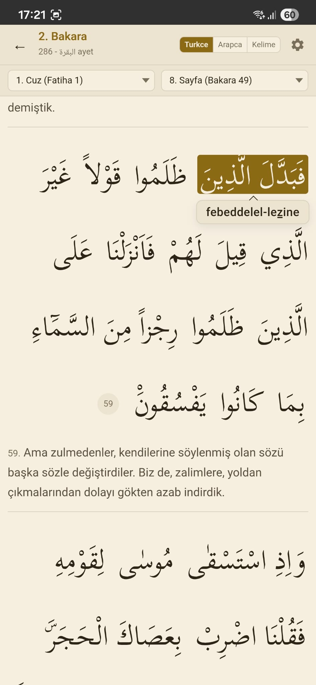
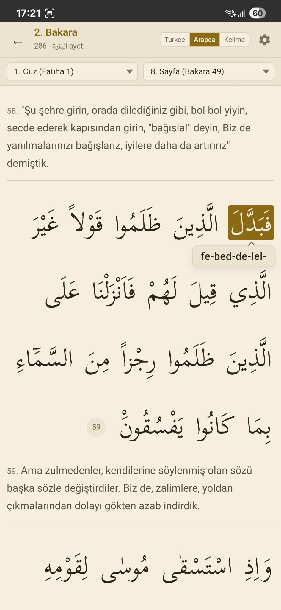
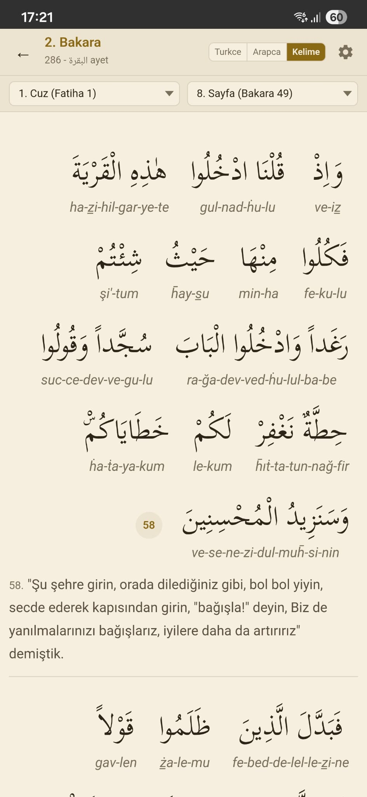

# Kur'an Satır Arası — Türkçe Fonetik

Kur'an-ı Kerim'i **Arapça metniyle hizalı, Türkçe fonetik okunuşla** sunan açık kaynaklı bir okuma uygulaması. Amaç: Arapça bilmeyenlerin Arapça metni doğru telaffuzla takip edebilmesi, kelime kelime karşılığını görebilmesi, tecvid kurallarını yazıdan okuyabilmesi.

- **Web demo:** `demo/index.html` (tek dosya)
- **Android APK:** [GitHub Releases](https://github.com/Quirah/turkce-fonetik-kurani-kerim/releases)

## Neden bu uygulama?

Kur'an okumayı öğrenirken en çok işime yarayan şey evimdeki **satır arası Türkçe okunuşlu** Mushaf olmuştu. Fakat telefona geçtiğimde aynı deneyimi veren bir uygulama bulamadım: neredeyse hiçbiri Türkçe fonetik göstermiyor, gösterenler de ya kelime hizalaması sunmuyor ya da tecvidi yazıya dökmüyordu.

Profesyonel yazılımcı değilim; elimdeki tek alet Claude'du. İhtiyaca odaklanarak parça parça oturttum:

- **Türkçe fonetik** [Açık Kuran](https://acikkuran.com)'dan çekiliyor.
- **Kelime bazlı bubble mekaniği** [QuranWBW](https://quranwbw.com)'nin kelime hizalı verisinden geliyor.
- **Tecvid** (peltek, kalın, idğâm) Türkçe alfabenin karşılayamadığı sesler için birleşik Unicode işaretleriyle yazıya dökülüyor.
- Okunuş iki farklı şekilde gruplanıyor: **Türkçe fonetiğe göre** (ortak okunan parçalar tek bubble) ve **Arapça kelimeye göre** (her kelime ayrı bubble).

Amacım "mükemmel bir Kur'an uygulaması yazmak" değildi; sadece evimdeki Mushaf'ı cebime taşımaktı. Büyük ihtimalle buradan çok ileri götüremem — ama en azından açık bıraktım, kullanmak ya da üzerine bir şeyler eklemek isteyen olursa diye.

## Ekran görüntüleri

| Türkçe | Arapça | Kelime (WBW) |
|---|---|---|
|  |  |  |

## Özellikler

- **114 sure** + cüz (30) + sayfa (604) dropdown gezintisi
- Üç okuma modu: **Türkçe** (ortak okunuş grupları), **Arapça** (kelime başına), **Kelime** (WBW — her Arapça kelimenin hecelenmiş Türkçe okunuşu ve anlamı)
- İki tecvid seviyesi: **Temel** (sade okunuş) / **Tecvid** (peltek, kalın, idğâm işaretleri)
- İki Arapça kaynak: **Mushaf** (Uthmânî) / **Diyanet** (Açık Kuran)
- Ayet bazlı Diyanet meali
- Sayfa sınırlarında inline "Sayfa N · Cüz J" ayırıcı; kaydırma sırasında üst bardaki dropdownlar canlı güncellenir
- Temalar: Papirüs, Deniz, Gece
- Arapça ve fonetik yazı boyutu ayarları
- Son okunan ayeti hatırlar (bubble'a dokunulan ayet)
- Ayarlar ve kaldığın yer cihazda yerel kaydedilir (localStorage)

## Tecvid işaretleri

Türkçe alfabede Arapça harflerin tamamının karşılığı yoktur; birbirine yakın sesler aynı Türkçe harfe düşer. Tecvid modunda bu ayrımı **birleşik işaretlerle (Unicode combining marks)** gösteririz. Temel okunuşta harf sade (z, s, d, t, h, k) görünür.

### Peltek harfler — alt çizgi (U+0332)

Dil ucu dişlerin arasına değerek çıkarılan ince sesler.

| Arapça | İsim | Türkçe | Örnek |
|---|---|---|---|
| ذ | zel  | **z̲** (z + alt çizgi) | elle*z̲*ine (2:3) |
| ث | se   | **s̲** (s + alt çizgi) | s̲emer |

### Kalın harfler — üst nokta (U+0307)

Tınısı genizden/peltek olmayan, kalın ve emfatik çıkarılan sesler.

| Arapça | İsim | Türkçe | Örnek |
|---|---|---|---|
| ض | dâd  | **ḋ** (d + üst nokta) | e*ḋ*âe (2:20) |
| ط | tı   | **ṫ** (t + üst nokta) | yaḣ-*ṫ*afu (2:20) |
| خ | hı   | **ḣ** (h + üst nokta) | *ḣ*afilîn |

### Kalın ح — üst çizgi (U+0304)

ح (hâ) sesi Türkçede yine "h" ile karşılanır ama telaffuzu boğazdan ve daha güçlüdür. Dot-above'lu ḣ (خ) ile karıştırmamak için üst çizgi kullanılır.

| Arapça | Türkçe | Örnek |
|---|---|---|
| ح | **h̄** (h + üst çizgi) | rah̄mân, rah̄îm (1:1) |

### Kalın + peltek — ظ

ظ (zı) hem peltek hem kalın çıkar; ikisi de bindirilir.

| Arapça | Türkçe | Örnek |
|---|---|---|
| ظ | **ż̲** (z + alt çizgi + üst nokta) | aż̲leme (2:20) |

### Kâf-ı kalın — ق

ق (kâf) sesi Türkçede **g** ile karşılanır (kalın "q" yerine gırtlaktan "g").

| Arapça | Türkçe |
|---|---|
| ق | **g** (k değil) |
| ك | **k** (kef, sade) |

Örnek: *ga*-mû (2:20), *g*adîr, *g*ıyâme.

### İdğâm (birleşme) işareti — kısa çizgi

İki Arapça kelime birbiriyle tecvid gereği kesintisiz okunuyorsa, okunuş metninde tire ile bağlanır ve **ortak bir bubble** oluştururlar:

- `min-kablikum` — nûn sâkine + qâf = **ihfâ**
- `lehum-meşev` — mîm + mîm = **idğâm misleyn**
- `rabihat-ticâretuhum` — tâ + tâ = **idğâm misleyn**
- `en-naas`, `er-rahmân` — şemsi idğâm (lâm-ı ta'rif)

Tanvîn/nûn sâkinenin `m/v/y/l/r` önünde değişmesi (idğâm) otomatik uygulanır: "men" → "mem", "en" → "el" vs.

## Veri kaynakları

| Dosya | Kaynak | Açıklama |
|---|---|---|
| `data/arabic-uthmani.json` | Tanzil Uthmânî | Arapça Mushaf metni |
| `data/arabic-acikkuran.json` | acikkuran.com | Arapça (Diyanet stili) |
| `data/quranwbw-syllables.json` | quranwbw.com | Kelime bazlı İngilizce heceleme + tecvid ipuçları |
| `data/acikkuran-turkish-phonetic.json` | acikkuran.com | Türkçe okunuş (satır bazında) |
| `data/diyanet-meal.json` | Diyanet | Türkçe meal |
| `data/wbw-turkish-meanings.json` | türetilmiş | Kelime kelime Türkçe anlamlar |
| `output/turkish-syllables.json` | üretilen | Temel seviye kelime bazlı hece çıktısı |
| `output/turkish-syllables-tajweed.json` | üretilen | Tecvid işaretli çıktı |

## Mimari

- **`src/convert.js`** — WBW heceleri ile Açık Kuran Türkçe okunuşunu kelime bazında hizalar.
- **`src/align.js`, `src/normalize.js`** — karakter normalizasyonu ve eşleme yardımcıları.
- **`generate.js`** — çıktıya tecvid işaretlerini (peltek, kalın, kaf→g, idğâm) uygular; temel ve tecvid JSON'larını üretir.
- **`demo/index.html`** — tek dosyalık web uygulaması (HTML + CSS + JS; framework yok).
- **`apk-build/`** — Capacitor ile Android APK paketleme (web uygulamasının aynısı WebView içinde).

## Kullanım

### Veriyi yeniden üretmek

```bash
npm install
npm run generate
# output/turkish-syllables.json ve turkish-syllables-tajweed.json yenilenir
```

### Web demo

```bash
python -m http.server 8000
# http://localhost:8000/demo/
```

`demo/index.html` doğrudan dosya sisteminden de açılabilir ama `fetch` cross-origin politikası yüzünden veri yüklemesi HTTP sunucusu ister.

### APK derleme

```bash
cd apk-build
npx cap sync android
cd android
./gradlew assembleDebug
# çıktı: apk-build/android/app/build/outputs/apk/debug/app-debug.apk
```

APK'yı telefona yüklemek için Android'de "Bilinmeyen kaynaklardan yükle" izni gerekir.

### Obtainium ile otomatik güncelleme

[Obtainium](https://obtainium.imranr.dev), GitHub Releases'tan doğrudan APK kurup otomatik güncelleme takibi yapan bir uygulamadır.

1. Obtainium'u kur (F-Droid veya kendi GitHub Releases'ı).
2. **Add App** → URL alanına `https://github.com/Quirah/turkce-fonetik-kurani-kerim` yapıştır.
3. **Add** → **Install**. Sonraki sürümler Obtainium'dan tek tıkla güncellenir.

## Lisans

Kod: **MIT** ([LICENSE](LICENSE))

Veri lisansları kaynak sağlayıcılarına aittir (Tanzil, QuranWBW, Açık Kuran, Diyanet). Mushaf metninin kendisi kamu malıdır.

## Teşekkür

- [quranwbw.com](https://quranwbw.com) — kelime bazlı heceleme, sayfa/cüz indeksi
- [acikkuran.com](https://acikkuran.com) — Türkçe okunuş, Diyanet meali
- [Tanzil](https://tanzil.net) — Uthmânî Mushaf metni
- [Mahfuz](https://mahfuz.ilg.az/about) — UI esini
